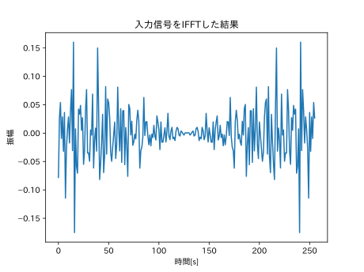
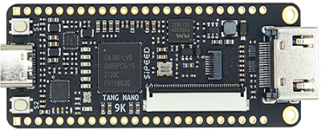

# **FPGAを用いたOFDM復調器の作成**
2024/10/09
T536 山口雄大

---

# 目次
1. 理論
1. 流星バースト通信のプロトコル
1. シミュレーション結果
1. FPGA
1. 今後の予定

---

# OFDM採用の背景

- 流星バースト通信の受信電力$E$は時間$t$の経過で指数関数的に減少。
    - $E(t)=\exp(-t/\tau)$
    - 短い時間で情報を伝送する必要がある。
- 複数の搬送波を用いて並列伝送を行う**OFDM**を採用。

---

# OFDM(直交周波数分割多重方式)
- 変調時は**逆離散フーリエ変換**(IDFT)を行い、
  復調時は**逆フーリエ変換**(DFT)を行う。
- 周波数利用効率が優れている。
  - 三角関数の直交性
$
\int_0^T \cos{mx}\cos{nx}dx = \left\{
\begin{array}{ll}
0 & (n\neq m)\\
1/2 & (n= m)
\end{array}
\right.
$

---

# FDMとOFDMの比較
- 三角関数の直交性を利用→OFDMの方が周波数利用効率がいい


---

# OFDMでDFTを行う理由
- 複数の搬送波を掛け合わせる回路は規模大
- DFTを使うと回路規模が小さくなる。

---

# DFTからFFTへ
- DFTは計算量が$\Omicron(N^2)$
- FFTを使用すると、Nが2の冪乗のとき、$\Omicron(N\log{N})$で計算可能。

---

# フーリエ変換復習
フーリエ変換　　　　　　　$X(\omega)=\int_{-\infty}^{\infty}x(t) e^{-j \omega t}dt$

フーリエ逆変換　　　　　　$x(t)=\frac{1}{2\pi}\int_{-\infty}^{\infty}X(\omega) e^{j \omega t}dt$

離散フーリエ変換(DFT)　　 $X[k]=\sum_{n=0}^{N-1}x[n] e^{-j\frac{2\pi k n}{N}}$

離散フーリエ逆変換(IDFT)　$x[n]=\frac{1}{N}\sum_{k=0}^{N-1}X[k] e^{j\frac{2\pi k n}{N}}$

---

# FFT
- 計算量:$\Omicron(N\log{N})$
- ポイント:添字の偶奇を分けて考える。
  - 分割統治法

---
DFT:$F_k=\sum_{n=0}^{N-1}f_n e^{-j\frac{2\pi n k}{N}},f_n^e\equiv f_{2n}, f_n^o\equiv f_{2n+1}, W_N\equiv e^{-j\frac{2\pi n k}{N}}$
偶奇で分ける
$$F_k=\sum_{n=0}^{N-1}f_n W_N^{kn} = \sum_{n=0}^{N/2-1}f_e W_{N/2}^{kn} + W_N^k \sum_{n=0}^{N/2-1}f_o W_{N/2}^{kn}$$
$F_k$の$k$に$k+N/2$を代入
$$F_k=\sum_{n=0}^{N-1}f_n W_N^{n(k+N/2)} = \sum_{n=0}^{N/2-1}f_e W_{N/2}^{n(k+N/2)} + W_N^{k+(N/2)}\sum_{n=0}^{N/2-1}f_o W_{N/2}^{n(k+N/2)}$$
---

$$\left\{
\begin{array}{ll}
W_{N/2}^{k+N/2}=e^{-j\frac{2\pi(k+N/2)}{N/2}}=e^{-j\frac{2\pi k}{N/2}} e^{-j2\pi}=e^{-j\frac{2\pi k}{N/2}}=W_{N/2}{k}\\
W_{N}^{k+N/2}=e^{-j\frac{2\pi (k + N/2)}{N}}=e^{-j\frac{2\pi k}{N}} e^{-j\pi}=-e^{-j\frac{2\pi k}{N}}=W_N^k\\
\end{array}
\right.$$
を用いると
$$F_k=\sum_{n=0}^{N-1}f_n W_N^{n(k+N/2)} = \sum_{n=0}^{N/2-1}f_e W_{N/2}^{n(k+N/2)} + W_N^{k+(N/2)}\sum_{n=0}^{N/2-1}f_o W_{N/2}^{n(k+N/2)}$$
$$=\sum_{n=0}^{N/2-1}f_e W_{N/2}^{kn} - W_N^k\sum_{n=0}^{N/2-1}f_o W_{N/2}^{kn}$$
計算量が$\Omicron(N^2)$から$\Omicron(N\log{N})$になった！

---
# IDFT
FFTとIFFTの実装を共通化できると嬉しいので、IDFTをDFTを使って表現
$$x[n]=\frac{1}{N}\sum_{k=0}^{N-1}X[k] e^{j\frac{2\pi k n}{N}}=\frac{1}{N}\overline{\sum_{k=0}^{N-1}\overline{X[k]}e^{-j\frac{2 \pi k x}{N}}}$$
- $X[k]$の複素共役をとる。
- $\overline{X[k]}$をDFTする。
- その結果を複素共役し、最後に$1/N$すればOK

---
# FFTの実装(再帰)
動的確保のできる配列を使うといい感じに実装できる。
```
C++かPythonで実装する
```

---

# bit-reverse
---

# 再帰プログラム(cooley turkey)

---

# FFTプログラム(非再帰)

---

# 相関

---

# OFDM変調器の構成
<!-- TODO:実部のみの波に変換するところ詳しく -->


---

# OFDM復調器の構成


---

# OFDM信号仕様1
周波数帯域:1~6[kHz]
シンボル周期:20[ms]
パイロット信号:1000,1050,2700,4350,6000[Hz],振幅2、位相0度
パイロット信号以外のサブキャリアはMSBファースト、
電力1、位相0deg=1、180deg=0、**12バイト**を転送する


---

# OFDM信号仕様2
20msのOFDMシンボルを9回連続送信し、20ms休止する。


---

# 計算機シミュレーション
理論の確認のため、PC上でシミュレーションを行った。
12バイトの乱数を生成→変調→復調→確認
という一連の流れを行った。

---

# シミュレーション環境
- OS: Debian 12(Linux)
- プログラミング言語:Python3.11
- 使用ライブラリ(一部)
  - numpy
  - scipy
  - matplotlib

---

# シミュレーション結果1
`[ 88  38 193 198  84  97  74  29  48  51 192  23]`の計12バイトを伝送した


---

# シミュレーション結果2


---

# FPGA
中国のSipeed社から発売されているTang Nano 9Kを使用。
値段は秋月電子で2980円と安価。



---

# FPGAの開発環境
- FPGA: Tang Nano 9k
- IDE:Gowin_V1.9.9.03_Education
- Writer:openFPGAloader
  - IDEに搭載されている書き込み機が私の環境では安定して動かなかったため、別のツールを使用することにした。

---

# FPGAの進捗状況
- できたこと
  - 開発環境構築
  - Lチカ
- 今後やること
  - シリアル通信
  - FFT
  - ADC
  - 復調基板作成
  - 復調プログラム作成

---

# 復調器の回路構成


---

# サンプルホールド回路
OFDMはタイミングがシビアなので、実部と虚部のサンプリングタイミングがずれないようにするために使う。
参考:https://akizukidenshi.com/goodsaffix/OP_AMP_APP_J_REL.pdf
